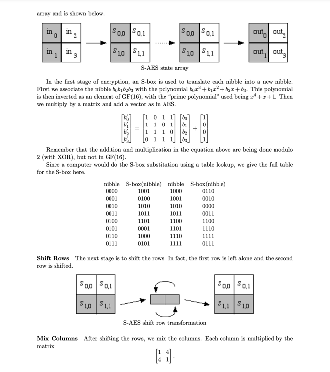
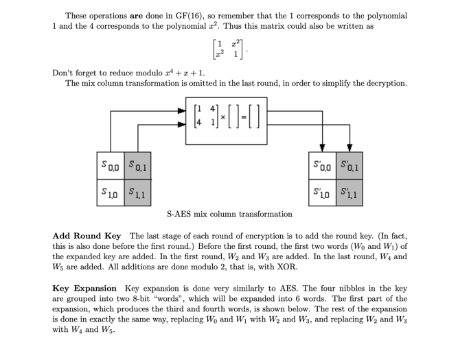
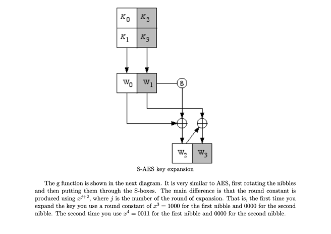
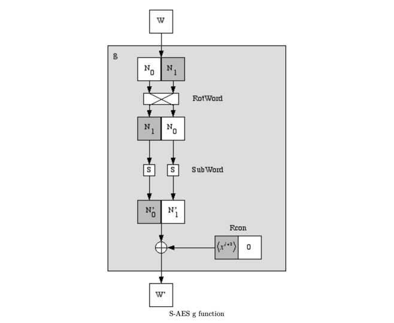

[![Contributors][contributors-shield]][contributors-url]
[![Forks][forks-shield]][forks-url]
[![Stargazers][stars-shield]][stars-url]
[![Issues][issues-shield]][issues-url]
[![Vue][Vue.js]][Vue-url]
[![Spring][Springboot]][Springboot-url]


<!-- PROJECT LOGO -->
<br />
<div align="center">
  <a href="https://github.com/Jinlkj/SAES-BackEnd">
    
  </a>

<h3 align="center">重庆大学大数据与软件学院</h3>

  <p align="center">
    信息安全导论SAES（Simplified AES Algorithm）加密算法复现
    <br />
    <a href="https://github.com/Jinlkj/SAES-BackEnd"><strong>去看看项目后端 »</strong></a>
    <br />
    <br />
    <a href="https://jinlkj.github.io/SAES-FrontEnd/">观看演示</a>
    ·
    <a href="https://github.com/Jinlkj/SAES-BackEnd/issues">报告bug</a>
    ·
    <a href="https://github.com/Jinlkj/SAES-BackEnd/issues">申请功能</a>
  </p>
</div>


<!-- 目录 -->
<details>
  <summary>目录</summary>
  <ol>
    <li><a href="#关于项目">关于项目</a></li>
    <li><a href="#项目框架">项目框架</a></li>
    <li><a href="#算法详解">算法详解</a></li>
    <li><a href="#运行该项目">运行该项目</a></li>
  </ol>
</details>


<!-- ABOUT THE PROJECT -->
## 关于项目

[![项目示例][product-screenshot]](https://example.com)

AES加密算法是一种对称加密算法，它使用相同的密钥进行加密和解密。它是一种块密码算法，将数据分成固定长度的块，每个块都使用相同的密钥进行加密。AES加密算法使用128位、192位或256位的密钥，具体取决于要加密的数据的安全级别。它是一种替换-置换网络，也称为SP网络。它由一系列链接操作组成，包括将输入替换为特定输出（替换）和涉及位移动（置换）的其他操作。

AES算法优势:
* 安全性高
* 加密速度快
* 硬件实现方便
* 可扩展性强

AES算法劣势：
* 算法复杂度高
* 密钥管理困难
* 密文长度固定

Simplified AES (SAES) 是一种教学用的加密算法，它是 AES 的简化版本。SAES 的设计目的是为了帮助学生更好地理解 AES 的工作原理。SAES 和 AES 的主要区别在于它们处理数据的方式和复杂性。

相比之下，SAES 使用更小的密钥和数据块大小，这使得加密过程更容易理解和实现。然而，这也意味着 SAES 在安全性上不如 AES。因此，虽然 SAES 对于教学和学习目的来说非常有用，但在需要高级安全性的实际应用中，我们通常会使用 AES 而不是 SAES。


### 项目框架

[![Spring][Springboot]][Springboot-url]  [![Vue][Vue.js]][Vue-url]

### 算法详解





[（原文链接）](https://www.rose-hulman.edu/class/ma/holden/Archived_Courses/Math479-0304/lectures/s-aes.pdf)
<!-- GETTING STARTED -->
## 运行该项目

这是一个前后端分离的项目，后端请查看: [项目后端](https://github.com/Jinlkj/SAES-FrontEnd)

### 准备
在运行项目之前，请确保安装了以下先决条件：

* Node.js

### 安装

```sh
npm install
```

### 编译并热加载

```sh
npm run dev
```

### 为生产编译和最小化

```sh
npm run build
```

5. 应用程序地址：http://localhost:5173。
6. 探索应用程序的功能。
7. 要停止应用程序，请在运行应用程序的终端中按下 Ctrl + C。


<p align="right">(<a href="#readme-top">back to top</a>)</p>


<!-- MARKDOWN LINKS & IMAGES -->
<!-- https://www.markdownguide.org/basic-syntax/#reference-style-links -->
[contributors-shield]: https://img.shields.io/github/contributors/Jinlkj/SAES-BackEnd.svg?style=for-the-badge
[contributors-url]: https://github.com/Jinlkj
[forks-shield]: https://img.shields.io/github/forks/Jinlkj/SAES-BackEnd.svg?style=for-the-badge
[forks-url]: https://github.com/Jinlkj/SAES-BackEnd/network/members
[stars-shield]: https://img.shields.io/github/stars/Jinlkj/SAES-BackEnd.svg?style=for-the-badge
[stars-url]: https://github.com/Jinlkj/SAES-BackEnd/stargazers
[issues-shield]: https://img.shields.io/github/issues/Jinlkj/SAES-BackEnd.svg?style=for-the-badge
[issues-url]: https://github.com/Jinlkj/SAES-BackEnd/issues
[Vue.js]: https://img.shields.io/badge/Vue.js-35495E?style=for-the-badge&logo=vuedotjs&logoColor=4FC08D
[Vue-url]: https://vuejs.org/
[Springboot]: https://img.shields.io/badge/Springboot-brightgreen?style=for-the-badge&logo=Springboot&logoColor=white
[Springboot-url]: https://spring.io
[product-screenshot]: images/screenshot.png
